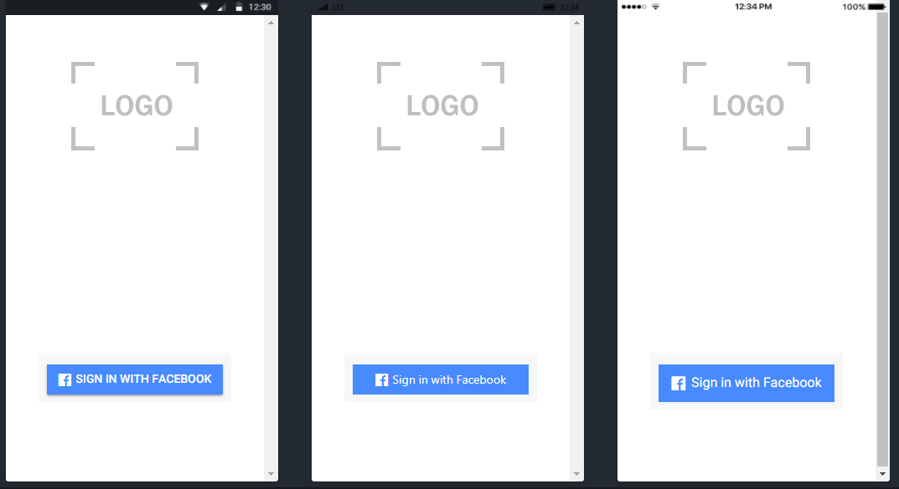

# Ionic Login Facebook :iphone: 
Este repositório contém um app em Ionic de Autenticação de Login com o Facebook.
O tutorial está disponível em [Tutorial Ionic]()



# Requisitos
* [Node.js](https://nodejs.org/en/)
* [Ionic](https://ionicframework.com/docs/intro/installation/)

# Instalação
Entrar na pasta do projeto e rodar o npm:
```
> npm Install

```

# Tutorial
Para acessar cada passo do tutorial separadamente, criamos um branch para cada passo, ou seja se você quiser acessar o 1º Passo, basta:

Mudar o branch para:
```
> git checkout passo1

```

# Rodando o Aplicativo no navegador
No navegador basta iniciar o servidor do Ionic (na pasta do projeto):

```
> ionic serve

```

E acessar a URL com o endereço http://localhost:8100/ e ser feliz :)